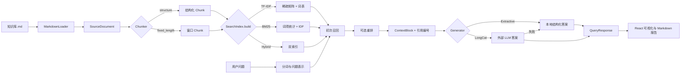

# RAG 代码模块实现笔记

> 对应项目版本：`0.3.0`  
> 后端目录：`backend/app/rag/`  
> 目标：从代码视角解释这个 Demo 如何完成“加载、切分、表示、索引、检索、重排、上下文构造、生成、引用和可视化”的完整 RAG 流程。

## 1. 当前实现边界

这个项目实现的是一套**小型、可解释、可复现的教学型 RAG**。它优先展示每一步的输入、输出和计算依据，而不是追求大规模生产性能。

当前可运行方法如下：

| 阶段 | 已实现方法 | 规划中的扩展 |
| --- | --- | --- |
| 文档加载 | 单文件 Markdown 加载 | PDF、Word、网页、多文件目录 |
| 文本切分 | 标题/段落结构切分、固定长度滑动窗口、TF-IDF 语义凝聚度切分 | Embedding 深层语义切分 |
| 文本表示 | TF-IDF 稀疏向量、BM25 词项统计 | 稠密 Embedding |
| 检索 | TF-IDF、BM25、TF-IDF + BM25 混合检索 | 向量数据库检索 |
| 重排 | 不重排、查询词覆盖率重排 | Cross-Encoder 重排 |
| 生成 | 本地结构化抽取、LongCat-2.0 | 更多 OpenAI 兼容模型 |
| 可观测性 | Chunk、词项权重、分数分量、上下文、Prompt、引用、Trace、耗时、Token | 离线评测集与指标看板 |

需要特别说明：当前“向量写入”是把 TF-IDF 稀疏矩阵、BM25 统计和 Chunk 元数据写入**进程内存中的索引对象**，没有使用 FAISS、Chroma、Milvus 等外部向量数据库。这是为了让第一版原理更直观，也避免小知识库 Demo 被基础设施掩盖。

## 2. 端到端数据流



一次查询的核心调用链为：

```text
POST /api/query
-> RagPipeline.query()
-> 必要时 build_index()
-> SearchIndex.search()
-> rerank()
-> ExtractiveTeachingGenerator.build_context()
-> _generate_answer()
-> QueryResponse
-> React 页面展示
```

## 3. 模块与职责

| 文件 | 主要职责 |
| --- | --- |
| `backend/app/rag/models.py` | 定义所有阶段之间传递的数据结构和 API 契约 |
| `backend/app/rag/loader.py` | 读取 Markdown、统计文档信息、推断章节 |
| `backend/app/rag/chunkers.py` | 结构切分、固定长度切分和切分器工厂 |
| `backend/app/rag/index.py` | 中文分词、TF-IDF、BM25、混合索引和检索 |
| `backend/app/rag/reranker.py` | 查询词覆盖率重排 |
| `backend/app/rag/generator.py` | 上下文构造、本地意图识别、选句和结构化答案 |
| `backend/app/rag/llm.py` | LongCat 配置、OpenAI 兼容调用、引用解析和错误包装 |
| `backend/app/rag/pipeline.py` | 编排完整 RAG 流程，记录 Trace，处理自动重建和生成回退 |
| `backend/app/rag/methods.py` | 方法注册表、可用状态、优点和限制 |
| `backend/app/main.py` | FastAPI 生命周期、路由、CORS 和运行状态接口 |
| `frontend/src/lib/api.ts` | 与 Pydantic 模型对应的 TypeScript 类型和 HTTP 客户端 |
| `frontend/src/App.tsx` | 工作台状态、方法切换、各阶段可视化和报告导出 |

## 4. 数据模型：让中间过程成为正式输出

代码位置：`backend/app/rag/models.py`

普通问答 API 往往只返回 `answer`。这个 Demo 将中间阶段建模为一等数据，前端不需要猜测后端做了什么。

### 4.1 SourceDocument

`SourceDocument` 保存原文以及基础统计：

- `name`、`path`：来源定位；
- `content`：完整原文；
- `character_count`、`paragraph_count`、`section_count`：教学展示指标；
- `sections`：推断出的章节名列表。

### 4.2 Chunk

每个 Chunk 不只有文本，还保留：

- `id`：稳定的展示编号，如 `chunk-014`；
- `order`：文档内顺序；
- `section`：章节元数据；
- `start_char`、`end_char`：原文字符位置；
- `overlap_chars`：与前一个窗口实际重叠的字符数；
- `vector`：用于前端展示的词项权重摘要。

`vector` 只保存维度、非零项数量和前六个高权重词，不把完整稀疏向量发送给浏览器。这样既能讲清原理，又不会让响应被大量零值淹没。

### 4.3 RetrievalHit

检索结果同时保留初排和重排信息：

- `retrieval_rank`：初次检索名次；
- `rank`：最终名次；
- `score`、`score_label`：主分数及其含义；
- `score_components`：混合检索中的 TF-IDF/BM25 分量；
- `rerank_score`：重排分数；
- `matched_terms`：问题与 Chunk 的共同词项；
- `selected_for_context`：是否进入生成上下文。

### 4.4 PipelineStep

每个阶段都会生成一条 `PipelineStep`：

```text
id + name + status + duration_ms + summary + detail
```

`summary` 面向普通展示，`detail` 面向深入检查。例如检索阶段的 `detail` 包含查询词项、候选数量、分数类型和初始排名。

### 4.5 QueryResponse

`QueryResponse` 是完整问答结果，包含答案、意图、答案点、生成元数据、引用、检索结果、上下文、Prompt 预览、Trace、总耗时和索引状态。它把一次 RAG 执行变成可复盘的实验记录。

## 5. 文档加载与章节识别

代码位置：`backend/app/rag/loader.py`

### 5.1 加载过程

`MarkdownLoader.load()` 使用 UTF-8 读取 `data/source/知识库.md`，去除首尾空白，然后调用 `split_paragraphs()` 按空行拆成段落。

```text
原始字符流
-> 按 \n + 空白 + \n 识别段落边界
-> 去掉空段
-> 逐段推断章节
-> SourceDocument
```

### 5.2 章节推断

知识库并非严格使用 Markdown 标题，而是大量采用“标题：正文”格式，因此代码使用：

```regex
^([^：:\n]{2,24})[：:]
```

它表示：如果段落开头存在 2 到 24 个非换行、非冒号字符，后面紧跟中文或英文冒号，就把冒号前文本视为章节名。无法识别时沿用上一个章节，初始兜底章节为“学社概览”。

优点是适合当前小知识库；限制是它不是通用 Markdown AST 解析器。以后处理复杂 Markdown 时，应改成基于标题节点、列表节点和表格节点的结构化解析。

## 6. 文本切分

代码位置：`backend/app/rag/chunkers.py`

所有切分器实现统一接口：

```python
class Chunker(ABC):
    def split(self, document: SourceDocument) -> list[Chunk]: ...
```

`get_chunker()` 根据方法 ID 创建具体实现，使 Pipeline 不依赖某一种切分算法。

### 6.1 标题/段落结构切分

`StructureChunker` 的规则是：

1. 先按段落遍历原文；
2. 根据段首更新当前章节；
3. 普通段落直接成为一个 Chunk；
4. 超过 `620` 字符的长段落再按句末标点切分；
5. 单句仍超过限制时，才按字符硬切；
6. 记录每块在原文中的起止位置。

这套方法尽量保留自然语义边界。它特别适合当前“每个主题基本对应一个段落”的知识库。

优点：

- 章节和段落语义通常完整；
- 引用容易解释；
- Chunk 数量较少，检索结果直观。

限制：

- 强依赖原文排版；
- 不同段落长度可能差异很大；
- 隐含主题变化无法被识别。

### 6.2 固定长度滑动窗口切分

`FixedLengthChunker` 在原始字符流上使用窗口：

```text
step = chunk_size - overlap
window_i = content[start_i : start_i + chunk_size]
start_(i+1) = start_i + step
```

例如 `chunk_size=180`、`overlap=30` 时，每次向前移动 `150` 个字符。重叠区域能降低关键信息恰好被边界截断的风险。

实现还做了三件事：

- 去除每个窗口首尾空白，并重新计算真实位置；
- 记录与前一个 Chunk 的实际重叠字符数；
- 如果一个窗口跨越多个章节，将章节写成 `章节 A / 章节 B`。

参数约束为 `overlap < chunk_size`。Pydantic 先限制参数范围，切分器再检查二者关系，避免步长为零或负数。

优点：实现稳定、参数可控、适合作为基线。限制是可能截断句子和主题，Overlap 还会造成索引冗余与重复召回。

### 6.3 TF-IDF 语义凝聚度切分

`SemanticChunker` 先把段落作为基础语义单元；单个段落超过最大长度时，复用结构切分器按句子继续拆开。所有语义单元使用 jieba 分词和 unigram/bigram TF-IDF 表示，相邻单元计算余弦相似度：

```text
similarity_i = cosine(vector(unit_i), vector(unit_(i+1)))
```

遍历相邻单元时执行两个边界条件：

```text
合并后长度 > semantic_max_chars  -> 按长度断开
similarity_i < semantic_threshold -> 按语义凝聚度下降断开
否则                              -> 合并相邻单元
```

默认阈值为 `0.05`，最大长度为 `620`。当前中文小知识库使用稀疏表示后，相邻段落的余弦值整体较低，因此阈值没有照搬稠密 Embedding 常见范围。阈值越高越容易断开，阈值越低越容易合并。

每个语义 Chunk 额外保存：

- `boundary_similarity`：本 Chunk 与前一个语义单元边界处的相似度；
- `split_reason`：`document_start`、`semantic_drop` 或 `max_chars`；
- `semantic_unit_count`：当前 Chunk 合并了多少个基础单元。

优点是本地可复现、无需下载模型、边界分数可以完整展示，并能把相邻的勋章主题段落合并。限制是 TF-IDF 仍依赖词项重合，无法像 Sentence Embedding 一样识别用词完全不同但含义相近的段落。因此它是“可解释语义基线”，不是深层语义的最终形态。

### 6.4 对比时应观察什么

- Chunk 数量是否明显变化；
- 同一事实是否被切断；
- Overlap 是否让同一证据重复出现；
- 章节元数据是否准确；
- 检索第一名和最终答案是否随切分改变。

## 7. 中文分词与问题表示

代码位置：`backend/app/rag/index.py`

`tokenize()` 是三种本地检索方法共享的文本入口：

1. 使用 `jieba.lcut()` 对中文分词；
2. 仅保留中文、英文和数字词项；
3. 英文转小写；
4. 去掉“的、是、哪些、如何”等小型停用词集合。

统一分词很重要：文档和问题必须在同一词项空间中表达，否则无法正确比较。当前停用词表为教学目的手工维护，生产项目应使用领域词典、用户词典和经过评估的停用词表。

## 8. TF-IDF 稀疏向量索引

代码位置：`TfidfIndex`

### 8.1 建库

`TfidfVectorizer` 的关键配置为：

```python
tokenizer=tokenize
token_pattern=None
ngram_range=(1, 2)
sublinear_tf=True
```

这意味着词表同时包含 unigram 和 bigram，并对词频使用次线性缩放。Scikit-learn 默认平滑 IDF 可写为：

```text
tf'(t,d) = 1 + log(tf(t,d))
idf(t)   = log((1 + N) / (1 + df(t))) + 1
w(t,d)   = tf'(t,d) * idf(t)
```

向量默认做 L2 归一化。所有 Chunk 最终形成一个形状为：

```text
[Chunk 数量, 词表维度]
```

的 CSR 稀疏矩阵。这里就是当前 Demo 的“向量生成与写入索引”。

### 8.2 检索

问题通过同一个 `vectorizer.transform()` 映射到相同维度。归一化向量的余弦相似度为：

```text
cos(q, d) = (q · d) / (||q|| * ||d||)
```

由于向量已归一化，代码用 `linear_kernel(query_vector, matrix)` 直接得到点积。只保留分数大于零的结果，因此完全无词项交集的 Chunk 不会进入上下文。

### 8.3 可视化元数据

建库时每个 Chunk 会记录：

- 完整词表维度；
- 本 Chunk 的非零词项数量；
- 权重最高的前六个词项。

前端“表示与索引”页据此展示稀疏向量并不是一串神秘数字，而是由词项及其权重构成。

## 9. BM25 关键词检索

代码位置：`Bm25Index`

BM25 使用 `rank_bm25.BM25Okapi`。建库阶段保存每个 Chunk 的分词结果、词表和 IDF 统计。

BM25 的核心形式为：

```text
score(q,d) = Σ IDF(t) *
             [tf(t,d) * (k1 + 1)] /
             [tf(t,d) + k1 * (1 - b + b * |d| / avgdl)]
```

默认参数为 `k1=1.5`、`b=0.75`。它相对普通词频检索增加了：

- 词频饱和：一个词重复很多次后，收益逐渐变小；
- 长度归一化：避免长文档仅因词多而天然占优；
- 逆文档频率：越少见的词通常越有区分度。

代码只保留 BM25 分数大于零的 Chunk，并把问题中的已知词项返回给前端。Chunk 的“向量预览”实际展示的是 `词频 × 非负 IDF` 的高权重词项摘要，它用于解释，不是完整 BM25 得分向量。

## 10. TF-IDF + BM25 混合检索

代码位置：`HybridIndex`

混合检索同时建立 TF-IDF 与 BM25 索引。查询时先取两路分数，再分别按本次查询的最大值归一化：

```text
tfidf_norm(d) = tfidf(d) / max(tfidf)
bm25_norm(d)  = bm25(d)  / max(bm25)

fused(d) = 0.55 * tfidf_norm(d) + 0.45 * bm25_norm(d)
```

归一化是必要的，因为余弦相似度和 BM25 的数值范围不同，直接相加会让数值较大的一路支配结果。

`score_components` 会同时返回两个归一化分量，前端可展示“最终融合分数是怎样组成的”。当前权重是固定教学参数，不代表对所有数据最优；生产项目应使用验证集调参，也可以改成 RRF 等不依赖原始分数尺度的融合方法。

## 11. 初次召回与候选数量

代码位置：`RagPipeline.query()`

没有重排时：

```text
candidate_k = top_k
```

启用重排时：

```text
candidate_k = top_k * 3
```

原因是重排只有在“先多召回、再精选”时才有意义。如果初检只拿最终需要的 `top_k`，重排只能改变顺序，无法从更大的候选集合中补救。

检索 Trace 会记录：

- `candidate_k`；
- 问题表示命中的索引词项数；
- 问题高权重/已知词项；
- 分数名称；
- 初始 Chunk 排名。

## 12. 查询词覆盖率重排

代码位置：`backend/app/rag/reranker.py`

先把问题和候选 Chunk 都转换成词项集合：

```text
coverage(d) = |query_terms ∩ chunk_terms| / |query_terms|
retrieval_norm(d) = retrieval_score(d) / max(retrieval_score)

rerank_score(d) = 0.65 * retrieval_norm(d) + 0.35 * coverage(d)
```

排序时先比较 `rerank_score`，相同则以原始检索分数为次级条件。最终保留前 `top_k`，同时保留 `retrieval_rank`，因此前端能显示某个 Chunk 从初排第几名变到终排第几名。

它的价值是用透明规则展示“两阶段检索”，但它仍然依赖字面词交集，不能理解深层语义。Cross-Encoder 会把“问题 + 候选文本”成对输入模型，通常更准确，但推理成本更高。

## 13. 上下文构造

代码位置：`ExtractiveTeachingGenerator.build_context()`

最终命中的 Chunk 按排名转换为 `ContextBlock`：

```text
第 1 个命中 -> [1]
第 2 个命中 -> [2]
...
```

每块保留 `chunk_id`、章节、正文和引用编号。上下文顺序非常重要，因为 `[1]`、`[2]` 既用于 Prompt，也用于回答后的引用回溯。

当前策略直接拼装所有最终命中，没有额外 Token 预算裁剪。小知识库中足够直观；大规模系统需要加入最大上下文长度、去重、相邻 Chunk 合并和按 Token 截断。

## 14. 本地结构化抽取生成

代码位置：`backend/app/rag/generator.py`

这个生成器不调用外部模型。它把“生成阶段”拆成可观察的规则，用于理解 RAG 在没有 LLM 时仍可如何基于证据回答。

### 14.1 意图识别

根据问题中的标志词分为：

- `list`：哪些、哪几、列出、类型等；
- `process`：流程、步骤、如何加入等；
- `fact`：多少、什么时候、几点、是否等；
- `general`：其他一般问题；
- `fallback`：证据不足。

### 14.2 候选句生成

每个命中 Chunk 按 `。！？；` 切句。只有命中主题词的句子才成为候选，减少与问题无关的内容进入答案。

主题词由问题词项减去“学社、需要、流程、介绍”等通用词得到。候选句分数为：

```text
candidate_score =
    0.50 * topic_coverage
  + 0.15 * query_coverage
  + 0.20 * normalized_retrieval_score
  + 0.45 * intent_structure_bonus
```

其中结构奖励用于识别“分为、包括、第一步、→”等枚举或流程信号。

### 14.3 证据门槛

基础证据充分需要同时满足：

```text
第一名检索分数 >= 0.07
主题词总体覆盖率 >= 0.34
```

门槛用于避免“只碰巧命中一个普通词”时强行作答。若最终没有合格答案点，则返回明确的知识库无答案提示，不生成引用。

### 14.4 结构解析

对于枚举句：

```text
勋章分为特别勋章、技术勋章、宣传勋章……
```

代码识别“分为”之后的部分，再按顿号、以及、和、及拆成独立答案点。

对于流程句：

```text
扫码加入面试群 → 填写报名表 → 完成考核期 → 成为正式成员
```

代码按箭头拆成有序步骤。所有拆出的答案点都指回同一个来源 Chunk。

### 14.5 一般选句与去重

若不能解析成明确列表/流程，则按候选分数选择证据句，并执行：

- 包含关系去重；
- 优先选择覆盖新主题词的句子；
- 低于最佳分数一定比例且没有新增信息的句子跳过；
- 最多选择 4 个答案点。

最终每个 `AnswerPoint` 保存正文、引用、Chunk ID 和选择原因。

## 15. LongCat-2.0 外部生成

代码位置：`backend/app/rag/llm.py`

### 15.1 配置读取

`LongCatSettings.from_env_file()` 从项目根目录 `.env` 读取：

```dotenv
LONGCAT_API_KEY=replace-with-your-api-key
LONGCAT_BASE_URL=https://api.longcat.chat/openai/v1
LONGCAT_MODEL=LongCat-2.0
LONGCAT_TIMEOUT_SECONDS=60
LONGCAT_MAX_TOKENS=900
```

若 Base URL 没有 `/v1`，代码自动补齐。API Key 只进入 OpenAI 客户端，不进入 Prompt、Trace、运行状态接口或前端响应。

### 15.2 OpenAI 兼容调用

客户端调用：

```text
client.chat.completions.create(
    model=LongCat-2.0,
    messages=[system, user],
    temperature=0.2,
    max_tokens=配置值
)
```

System Prompt 约束模型：

- 只能依据提供的资料；
- 每条事实必须带 `[n]` 引用；
- 资料不足时明确拒答；
- 枚举和流程使用合适的结构；
- 不输出思考过程。

低温度用于减少随机性，让同题方法对比更稳定。

### 15.3 引用解析

模型回答返回后，代码用 `\[(\d+)]` 提取引用编号，并且只接受当前上下文中真实存在的编号。随后：

1. 按行查找带引用的答案点；
2. 去掉列表前缀和引用标记，保留干净正文；
3. 将引用编号映射回 `ContextBlock.chunk_id`；
4. 去重得到最终引用 Chunk 列表。

如果模型回答没有合法引用，答案仍可展示，但会返回 `generation_warning`，提醒这次回答缺少可验证来源。

### 15.4 Token 与完成状态

`GenerationMetadata` 保存：

- 请求方法和实际生效方法；
- Provider 与模型名；
- Prompt、Completion、Total Token；
- `finish_reason`；
- 是否发生回退。

### 15.5 错误与自动回退

以下情况会被包装为可读错误：

- 未配置 Key；
- 请求超时；
- 网络连接失败；
- 上游 HTTP 错误；
- 空回答或其他调用异常。

`RagPipeline._generate_answer()` 捕获这些错误后自动调用本地结构化生成器，并设置：

```text
requested_method = longcat
effective_method = extractive
fallback_used = true
```

前端因此可以区分“用户选择了 LongCat”和“本次真正使用了本地回退”，而不会把回退结果伪装成模型结果。

## 16. Pipeline 编排与状态管理

代码位置：`backend/app/rag/pipeline.py`

### 16.1 建库流程

`build_index()` 依次执行：

```text
load -> chunk -> index
```

每一步用 `perf_counter()` 计时，生成 Trace。建库结束后保存当前切分配置、检索方法、构建时间、索引对象和最近一次构建 Trace。

### 16.2 自动重建

查询前会比较请求配置与当前索引配置。如果切分方法、检索方法或固定窗口参数发生变化，自动重建索引；否则复用当前索引，降低重复计算。

### 16.3 并发保护

Pipeline 使用 `RLock` 保护共享的内存索引。`query()` 内部可能再次调用 `build_index()`，因此使用可重入锁而不是普通 Lock。

当前设计适合单进程 Demo。若启动多个 Uvicorn Worker，每个进程会有自己的索引副本；生产部署应将索引持久化或交给独立检索服务。

### 16.4 完整 Trace

查询返回固定阶段：

```text
load -> chunk -> index -> retrieve -> rerank -> context -> generate
```

未启用重排时，`rerank` 仍保留在 Trace 中，但状态为 `skipped`。这样前端的流程图不会因配置不同而丢失阶段。

## 17. 方法对比如何保证隔离

代码位置：`backend/app/main.py` 的 `/api/compare`

对比接口接收 2 到 6 套配置。每套配置都创建一个新的 `RagPipeline`：

```text
配置 A -> 独立 Pipeline A -> QueryResponse A
配置 B -> 独立 Pipeline B -> QueryResponse B
```

这样一套配置重建索引不会污染另一套配置。前端在“检索、切分、生成”三种对比模式中只改变目标阶段，其他参数沿用当前配置，符合控制变量思想。

## 18. FastAPI 接口映射

代码位置：`backend/app/main.py`

| 方法与路径 | 作用 | 关键返回内容 |
| --- | --- | --- |
| `GET /api/health` | 最小健康检查 | 状态、版本 |
| `GET /api/runtime` | 安全运行摘要 | 知识库状态、LongCat 是否配置、方法清单 |
| `GET /api/methods` | 方法注册表 | 状态、介绍、优缺点 |
| `GET /api/knowledge-base` | 读取原始知识库 | 原文、章节、统计 |
| `GET /api/index/status` | 当前索引状态 | 方法、Chunk 数、维度、构建时间 |
| `POST /api/index/build` | 主动重建索引 | Chunk、向量预览、建库 Trace |
| `GET /api/chunks` | 分页读取当前 Chunk | Chunk 列表 |
| `POST /api/query` | 执行完整 RAG | 完整 `QueryResponse` |
| `POST /api/compare` | 隔离运行多套方法 | 多个并列 `QueryResponse` |

FastAPI 的 lifespan 在服务启动时建立默认的“结构切分 + TF-IDF”索引，因此浏览器首次打开即可查看 Chunk 和向量信息。

## 19. 前端如何对应 RAG 阶段

代码位置：`frontend/src/App.tsx`、`frontend/src/lib/api.ts`

| 页面 | 对应后端数据 | 学习重点 |
| --- | --- | --- |
| 问答工作台 | 配置、`POST /query` | 选择完整流水线并提问 |
| 知识库原文 | `SourceDocument` | 输入数据与章节统计 |
| 文本切分 | `Chunk[]` | 边界、位置、Overlap、结构差异 |
| 表示与索引 | `IndexStatus`、`VectorPreview` | 维度、非零词项、高权重词 |
| 检索与重排 | `RetrievalHit[]` | 初排、终排、命中词、分数组成 |
| 上下文 | `ContextBlock[]`、`prompt_preview` | 真正交给生成器的证据和 Prompt |
| 方法对比 | `ComparisonResponse` | 控制变量下的并列结果 |
| 完整 Trace | `PipelineStep[]` | 每阶段耗时、摘要和原始详情 |

前端初始化并行获取知识库、方法注册表、安全运行状态，同时建立默认索引。单次问答和方法对比都可以导出 Markdown 报告，便于课堂讲解或实验留档。

## 20. 测试覆盖

测试目录：`backend/tests/`

当前 15 项测试覆盖：

- 默认索引能建立，并返回 Chunk、维度与向量预览；
- 枚举问题能拆出五类勋章；
- 流程问题能拆出有序步骤；
- 事实问题不会把零分 Chunk 放进上下文；
- 无关问题触发无答案兜底；
- 固定长度切分正确记录 Overlap 和跨章节信息；
- 语义切分返回边界相似度、切分原因，并能响应阈值变化；
- 非法 `overlap >= chunk_size` 被拒绝；
- TF-IDF、BM25、Hybrid 都返回可解释分数；
- 重排保留前后排名；
- 对比接口使用隔离 Pipeline；
- LongCat 返回的引用、Token 和完成原因可解析；
- LongCat 失败时自动回退；
- 运行状态接口不暴露 API Key；
- 方法注册表正确暴露可用能力。

测试 LongCat 时使用 Fake Client，不发真实网络请求，也不消耗 API 配额。

## 21. 调试一次回答的推荐顺序

当答案不理想时，不要先怪生成模型。按下面顺序定位：

1. **原文是否有答案**：在“知识库原文”确认事实真实存在；
2. **切分是否保留完整语义**：检查答案是否被窗口切断；
3. **词项表示是否合理**：检查关键术语是否进入词表；
4. **召回是否命中正确 Chunk**：查看初排、分数和命中词；
5. **重排是否错误调整顺序**：比较 `retrieval_rank` 与 `rank`；
6. **上下文是否包含证据**：确认 Prompt 中确实有答案；
7. **生成是否正确使用证据**：检查答案点、引用和警告；
8. **外部模型是否回退**：查看 `effective_method` 与 `fallback_used`。

这也是 RAG 的关键思维：回答质量是多阶段系统共同作用的结果，必须保留中间数据才能知道问题发生在哪里。

## 22. 后续扩展的代码入口

### 22.1 已实现的 TF-IDF 语义凝聚度切分

`SemanticChunker` 将段落作为基础语义单元，使用与检索一致的 jieba 分词、unigram/bigram TF-IDF 表示，再计算相邻单元余弦相似度：

```text
similarity_i = cosine(unit_i, unit_(i+1))

当 similarity_i < semantic_threshold：建立语义边界
当合并后长度 > semantic_max_chars：建立长度边界
否则：将相邻单元合并到同一个 Chunk
```

默认参数为阈值 `0.05`、最大长度 `620`。每个 Chunk 额外返回 `boundary_similarity`、`split_reason` 和 `semantic_unit_count`，前端可直接展示边界依据。该实现无需新增模型，适合作为可解释语义切分基线；它依赖词项重合，还不等同于基于 Embedding 的深层语义切分。

### 22.2 新增稠密 Embedding

1. 在 `index.py` 实现 `SearchIndex`；
2. `build()` 批量编码 Chunk 并保存向量；
3. `search()` 编码问题并做相似度检索；
4. 在 `get_index()` 注册；
5. 在 `methods.py` 更新状态；
6. 为前端提供向量维度、范数或降维坐标等可解释摘要。

### 22.3 接入向量数据库

保持 `SearchIndex` 接口不变，将内存矩阵替换为：

```text
build: upsert(chunk_id, embedding, metadata)
search: similarity_search(query_embedding, top_k, filters)
```

需要额外处理集合版本、删除旧索引、批量写入、元数据过滤和服务不可用时的恢复。

### 22.4 新增 Cross-Encoder

在 `reranker.py` 中增加方法：先扩大候选集，将每个 `(question, chunk.text)` 输入模型，按相关度排序，再返回前 `top_k`。应额外记录模型名、批大小、推理耗时和重排分数。

### 22.5 新增评测模块

可以建立“问题、标准答案、相关 Chunk ID”的小型数据集，计算：

- 检索：Hit Rate、Recall@K、MRR、nDCG；
- 生成：引用准确率、答案覆盖率、忠实度；
- 系统：P50/P95 延迟、Token、费用、回退率。

## 23. 当前限制

- 只有一份本地 Markdown，尚无多文档增量更新；
- 索引仅在内存中，服务重启后重建；
- TF-IDF/BM25 依赖字面词匹配，近义表达能力有限；
- 本地生成规则针对中文知识库格式设计，不是通用自然语言生成器；
- LongCat 引用由 Prompt 约束和正则校验共同实现，仍需人工验证事实是否真正被引用支持；
- 对比结果当前面向人工观察，还没有自动质量评分；
- 单进程锁只解决 Demo 内共享状态问题，不等于生产级并发架构。

这组限制也是项目保留的学习入口：从当前透明基线出发，逐步替换切分器、索引、重排器和生成器，就能观察每一次升级究竟改变了什么。
