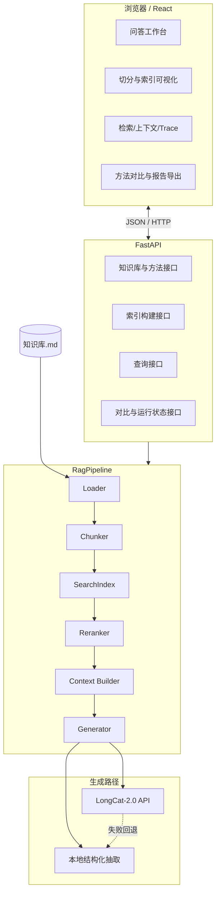

# RAG 可视化学习 Demo：项目实现与展示文档

> 项目版本：`0.3.0`  
> 项目目录：`/home/blue/code/rag/rag-demo`  
> 知识库：`data/source/知识库.md`

## 1. 项目简介

这是一个面向 RAG 学习、课堂讲解和方案对比的小型全栈 Demo。用户在浏览器中提出问题，系统不仅返回最终答案，还把文本切分、词项表示、索引、召回、重排、上下文、Prompt、生成、引用和耗时完整展示出来。

项目的核心目标不是把 RAG 包装成一个“只输入问题、只输出答案”的黑盒，而是回答下面这些学习问题：

- 原始知识库怎样被读取和拆成 Chunk？
- 结构切分与固定长度切分有什么区别？
- TF-IDF 和 BM25 分别怎样表示文本与计算相关性？
- 混合检索的最终分数从哪里来？
- 为什么初次召回之后还要重排？
- 哪些 Chunk 真正进入了生成上下文？
- Prompt 最终长什么样？
- 本地规则回答与外部 LLM 回答有何差异？
- 回答里的引用如何映射回证据？
- 一次失败发生在检索阶段还是生成阶段？

## 2. 适用场景与受众

项目适合：

- 第一次系统学习 RAG 全流程的开发者；
- 已学习机器学习，希望理解 NLP 应用工程的人；
- 需要向同学、老师或团队演示 RAG 原理的人；
- 想比较切分、检索、重排和生成方法的人；
- 准备进一步接入 Embedding、向量数据库和模型评测的人。

它与机器学习知识是相连的：TF-IDF 是特征表示，余弦相似度和 BM25 是排序方法，Embedding 是表示学习，Cross-Encoder 是监督相关性建模，而最终的 LLM 是条件生成模型。这个 Demo 先用透明的传统方法建立基线，再为机器学习模型保留替换入口。

## 3. 已实现能力

### 3.1 完整 RAG 主流程

```text
知识库加载
-> 文本切分
-> 中文分词
-> 表示生成与索引写入
-> 问题表示
-> 候选召回
-> 可选重排
-> 上下文拼装
-> 本地抽取或 LongCat 生成
-> 引用解析
-> 完整 Trace 与报告导出
```

### 3.2 方法矩阵

| 阶段 | 方法 | 状态 | 展示内容 |
| --- | --- | --- | --- |
| 切分 | 标题/段落结构切分 | 可用 | 章节、字符位置、Chunk 长度 |
| 切分 | 固定长度 + Overlap | 可用 | 窗口参数、重叠字符、跨章节信息 |
| 切分 | TF-IDF 语义凝聚度切分 | 可用 | 相邻余弦相似度、边界原因、合并单元数和阈值 |
| 检索 | TF-IDF | 可用 | 稀疏向量维度、高权重词、余弦相似度 |
| 检索 | BM25 | 可用 | 命中词和 BM25 相关度 |
| 检索 | TF-IDF + BM25 | 可用 | 两路归一化分量与融合分数 |
| 检索 | 稠密 Embedding | 规划 | 方法入口已预留 |
| 重排 | 不重排 | 可用 | 原始检索顺序 |
| 重排 | 查询词覆盖率 | 可用 | 重排分数和名次变化 |
| 重排 | Cross-Encoder | 规划 | 方法入口已预留 |
| 生成 | 结构化教学抽取 | 可用 | 意图、答案点、选句原因、引用、无答案兜底 |
| 生成 | LongCat-2.0 | 可用 | Prompt、Token、模型信息、完成原因、引用和失败回退 |

### 3.3 展示与交付能力

- 浏览器中的完整问答工作台；
- RAG 七阶段流程轨道；
- 当前 API、LongCat 和索引状态；
- 同题切分、检索、生成方法对比；
- 单次问答 Markdown 报告导出；
- 方法对比 Markdown 报告导出；
- FastAPI 自动接口文档；
- 后端自动测试和前端生产构建验证。

## 4. 技术栈

### 4.1 后端

| 技术 | 用途 |
| --- | --- |
| Python 3.11 | 后端与 RAG 核心语言 |
| FastAPI | REST API、参数验证、Swagger 文档 |
| Pydantic | 请求、响应和中间数据模型 |
| jieba | 中文分词 |
| scikit-learn | TF-IDF 和余弦相似度 |
| NumPy / SciPy | 排序与稀疏矩阵 |
| rank-bm25 | BM25Okapi 实现 |
| OpenAI Python SDK | 调用 LongCat 的 OpenAI 兼容接口 |
| python-dotenv | 从 `.env` 读取模型配置 |
| unittest | 核心流程自动测试 |

### 4.2 前端

| 技术 | 用途 |
| --- | --- |
| React | 页面和交互状态 |
| TypeScript | API 契约与类型检查 |
| Vite | 开发服务和生产构建 |
| Lucide React | 界面图标 |
| 原生 CSS | 响应式布局与教学可视化 |

项目没有额外引入重量级组件库或状态管理框架，小型 Demo 的数据流集中在 `App.tsx`，便于学习者直接追踪。

## 5. 总体架构



### 5.1 前后端边界

后端负责所有 RAG 计算，并把中间结果作为结构化 JSON 返回。前端不重复实现检索算法，只负责：

- 组合用户配置；
- 调用 API；
- 将中间数据映射到不同页面；
- 维护当前实验结果；
- 导出 Markdown 实验报告。

这样可以保证浏览器看到的分数、引用和 Trace 就是后端实际执行结果，而不是前端模拟动画。

### 5.2 索引存储方式

当前索引驻留在后端进程内存：

- TF-IDF：Scipy CSR 稀疏矩阵；
- BM25：分词语料和 BM25Okapi 统计；
- Hybrid：同时持有两套索引；
- Chunk 元数据：Pydantic 对象列表。

这种方式非常适合小知识库教学。它没有磁盘持久化和分布式能力，服务重启时会快速重建默认索引。

## 6. 项目目录

```text
rag-demo/
├── .env.example                 # LongCat 配置模板，不含真实密钥
├── .gitignore                   # 排除 .env、缓存和构建产物
├── README.md                    # 快速入口
├── environment.yml             # blue Conda 环境定义
├── data/
│   └── source/
│       └── 知识库.md             # 当前演示知识库
├── backend/
│   ├── requirements.txt
│   ├── app/
│   │   ├── main.py             # FastAPI 应用与路由
│   │   └── rag/
│   │       ├── models.py       # 数据契约
│   │       ├── loader.py       # 文档加载
│   │       ├── chunkers.py     # 文本切分
│   │       ├── index.py        # 表示、索引与检索
│   │       ├── reranker.py     # 重排
│   │       ├── generator.py    # 本地结构化生成
│   │       ├── llm.py          # LongCat 接入
│   │       ├── methods.py      # 方法注册表
│   │       └── pipeline.py     # 全流程编排
│   └── tests/                  # 15 项后端测试
├── frontend/
│   ├── package.json
│   └── src/
│       ├── App.tsx             # 工作台和全部视图
│       ├── styles.css          # 桌面/移动端样式
│       └── lib/api.ts          # API 类型与客户端
└── docs/
    ├── RAG代码模块实现笔记.md     # 代码到 RAG 原理映射
    ├── 项目实现与展示文档.md       # 本文档
    └── architecture/           # 各阶段演进记录
```

## 7. 环境准备

所有 Python 与 Node 命令都在 Conda 环境 `blue` 中执行。

### 7.1 创建环境

如果本机还没有该环境：

```bash
cd /home/blue/code/rag/rag-demo
conda env create -f environment.yml
conda activate blue
```

如果环境已经存在，只需：

```bash
conda activate blue
```

### 7.2 手动安装/核对依赖

后端：

```bash
cd /home/blue/code/rag/rag-demo
conda activate blue
python -m pip install -r backend/requirements.txt
```

前端：

```bash
cd /home/blue/code/rag/rag-demo/frontend
conda activate blue
npm install
```

当前版本不要求安装 PyTorch、CUDA Toolkit、FAISS 或本地大模型。LongCat 是外部 API，调用时不使用本地 GPU。以后接入本地 Embedding 或 Cross-Encoder 时，才需要根据显卡与 CUDA 版本安装 PyTorch、Transformers 和 Sentence Transformers。

## 8. LongCat 配置与安全

复制 `.env.example` 的字段到项目根目录 `.env`，填写自己的 Key：

```dotenv
LONGCAT_API_KEY=replace-with-your-api-key
LONGCAT_BASE_URL=https://api.longcat.chat/openai/v1
LONGCAT_MODEL=LongCat-2.0
LONGCAT_TIMEOUT_SECONDS=60
LONGCAT_MAX_TOKENS=900
```

安全设计：

- `.env` 已被 `.gitignore` 排除；
- API Key 不写入源代码；
- API Key 不进入 Prompt 和 Trace；
- `/api/runtime` 只返回是否已配置和模型名；
- 前端不会接收 API Key；
- 自动测试使用 Fake Client，不发真实模型请求。

如果未配置 LongCat，其他本地流程仍可完整运行。用户选择 LongCat 时，后端会显示警告并回退到本地抽取。

## 9. 启动方式

由于开发过程中 `8000` 可能已被其他后端占用，推荐演示使用后端 `8001`、前端 `5174`。

### 9.1 一键启动与关闭

推荐直接在项目根目录运行：

```bash
cd /home/blue/code/rag/rag-demo
./start.sh
```

脚本会：

- 检查 Conda、`blue` 环境、后端模块和前端依赖；
- 使用 `8001` 启动 FastAPI；
- 使用 `5174` 启动 React，并自动设置后端 API 地址；
- 分别等待后端健康检查和前端访问检查；
- 把 PID 写入 `.runtime/`，日志写入 `.runtime/logs/`；
- 检测重复启动和外部端口占用。

关闭服务：

```bash
cd /home/blue/code/rag/rag-demo
./stop.sh
```

关闭脚本只终止 PID 文件记录的本项目进程组，不会扫描并关闭其他端口进程。日志会保留，便于排查启动失败。

端口和环境可以覆盖：

```bash
RAG_CONDA_ENV=blue RAG_BACKEND_PORT=8010 RAG_FRONTEND_PORT=5180 ./start.sh
```

### 9.2 手动启动后端

终端一：

```bash
cd /home/blue/code/rag/rag-demo/backend
conda activate blue
uvicorn app.main:app --host 127.0.0.1 --port 8001
```

### 9.3 手动启动前端

终端二：

```bash
cd /home/blue/code/rag/rag-demo/frontend
conda activate blue
VITE_API_BASE=http://127.0.0.1:8001/api npm run dev -- --host 127.0.0.1 --port 5174
```

### 9.4 打开地址

- 前端工作台：`http://127.0.0.1:5174`
- API 文档：`http://127.0.0.1:8001/docs`
- 健康检查：`http://127.0.0.1:8001/api/health`
- 运行状态：`http://127.0.0.1:8001/api/runtime`

如果坚持使用默认端口，可将后端改为 `8000`，前端直接运行 `npm run dev`。遇到 `address already in use`，通常表示该端口已有服务，先访问健康检查确认，不要重复启动。

## 10. 首次打开时发生什么

1. FastAPI lifespan 读取 `知识库.md`；
2. 后端用“结构切分 + TF-IDF”建立默认内存索引；
3. React 获取知识库、方法注册表和运行状态；
4. React 请求默认配置的索引结果；
5. 侧边栏显示 API、LongCat 和版本状态；
6. 页面显示 Chunk 数、词表维度和可点击流程阶段。

用户改变切分/检索配置后，顶栏会从 `CONFIG APPLIED` 变为 `CONFIG CHANGED`。点击重建或直接提问时，后端按新配置建立索引。

## 11. 浏览器界面说明

### 11.1 问答工作台

作用：选择切分、检索、重排和生成方法，设置 `top_k`、窗口大小和 Overlap，然后提交问题。

适合展示：同一问题在不同配置下如何进入完整流水线。

### 11.2 知识库原文

作用：查看系统真实读取的资料、字符数、段落数和章节列表。

适合强调：RAG 不能凭空知道资料外的事实，第一步永远是确认知识源。

### 11.3 文本切分

作用：并列展示每个 Chunk 的 ID、章节、起止位置、字符数和 Overlap。

适合比较：结构切分是否保留完整主题，固定长度切分是否产生截断和重复。

### 11.4 表示与索引

作用：查看索引方法、Chunk 数、词表维度、向量生成与写入示意、高权重词项。

适合解释：当前“向量”是 TF-IDF 稀疏词项向量；BM25 是词项统计；当前写入的是内存索引，不是外部向量数据库。

### 11.5 检索与重排

作用：展示最终答案、模型元数据、引用、检索分数、分数组成、命中词、初排名和重排名。

这里的“导出演示报告”会下载一份 Markdown，包含配置、答案、引用、检索表和完整 Trace。

### 11.6 上下文

作用：展示进入生成器的 `ContextBlock` 和完整 Prompt 预览。

适合解释：检索命中不等于最终回答；只有进入上下文的证据，生成器才有机会使用。

### 11.7 方法对比

作用：在同一个问题下并列运行所有可用的切分、检索或生成方法。

切换对比类别会清除旧结果，避免把上一次检索对比误认为这一次生成对比。“导出对比”会保存每套方法的配置、耗时、Token 和回答。

### 11.8 完整 Trace

作用：按时间线查看七个 RAG 阶段的状态、耗时、摘要和原始详情。

适合调试：快速判断问题来自切分、召回、重排还是生成。

## 12. 推荐演示脚本

下面是一套约 12 到 18 分钟的演示流程。

### 第一步：确认输入与运行状态

1. 打开前端；
2. 指出侧边栏 `API CONNECTED`、`LONGCAT READY` 和版本；
3. 进入“知识库原文”；
4. 展示“图书馆与资源利用”“加入方式”“勋章机制”等章节。

讲解重点：系统所有回答都应该能够回到这份知识库，而不是使用模型的外部记忆。

### 第二步：展示结构切分

1. 进入“文本切分”；
2. 选择“标题/段落结构切分”；
3. 重建索引；
4. 查看 Chunk 章节、字符位置和文本完整性。

讲解重点：当前文档以主题段落为主，结构切分通常能保留完整事实。

### 第三步：展示固定窗口与 Overlap

1. 切换到“固定长度切分”；
2. 设置 `chunk_size=180`、`overlap=30`；
3. 重建索引；
4. 观察 Chunk 数增加、重复字符和跨章节标记。

讲解重点：固定窗口更通用，但可能截断语义；Overlap 用冗余换取边界稳健性。

### 第四步：跑通本地完整问答

配置建议：

```text
切分：结构切分
检索：TF-IDF
重排：不重排
生成：结构化教学抽取
top_k：4
```

示例问题：

```text
创新学社有哪些勋章？
```

预期现象：

- 意图识别为枚举；
- 返回特别、技术、宣传、组织和学社五类勋章；
- 多个答案点指向“勋章机制”Chunk；
- 生成元数据表明 Provider 为本地；
- 没有外部 Token 消耗。

### 第五步：展示流程问题

示例问题：

```text
加入学社需要经过哪些流程？
```

预期现象：

- 意图识别为流程；
- 按箭头结构拆出报名步骤；
- 答案以有序步骤展示；
- 每个步骤可追溯到同一个“加入方式”Chunk。

### 第六步：展示多事实问题与零分过滤

示例问题：

```text
图书馆什么时候开放，可以借多少本书？
```

预期现象：

- 命中“图书馆与资源利用”；
- 回答包含开放时间和 20 本借阅上限；
- 无分数的 Chunk 不进入上下文；
- 可以在上下文页确认生成器实际拿到了哪些资料。

### 第七步：比较检索方法

1. 进入“方法对比”；
2. 选择“检索”；
3. 使用同一个图书馆问题；
4. 运行 TF-IDF、BM25、Hybrid 对比。

观察重点：

- 三种方法是否召回相同第一名；
- 分数尺度为什么不能直接比较；
- Hybrid 卡片中 TF-IDF 与 BM25 分量如何组成融合分数；
- 耗时和回答是否变化。

### 第八步：展示重排

配置建议：

```text
检索：Hybrid
重排：查询词覆盖率重排
top_k：2
```

示例问题：

```text
图书馆开放时间和借书规则
```

观察重点：后端先召回 `top_k × 3` 个候选，再根据原始分数和问题词覆盖率重排；页面会显示初排与终排变化。

### 第九步：比较本地生成与 LongCat

1. 方法对比切换到“生成”；
2. 使用“创新学社有哪些勋章？”；
3. 并列运行本地抽取和 LongCat；
4. 比较语言自然度、答案结构、引用、耗时和 Token。

讲解重点：两条生成路径复用相同检索与上下文，所以此时主要变量是生成方法。

### 第十步：展示拒答与安全回退

无答案问题：

```text
火星基地的空气循环系统是什么？
```

本地生成应返回“没有足够相关内容”，且没有伪造引用。

LongCat 超时、断网或未配置时，页面会显示警告并标记 `fallback_used=true`，实际使用本地抽取完成回答。

### 第十一步：导出报告

1. 在检索结果页点击“导出演示报告”；
2. 在对比页点击“导出对比”；
3. 打开下载的 Markdown，展示实验配置、回答、引用、检索表、耗时与 Trace。

这一步适合用作课程作业附件、项目汇报材料或迭代前后的实验记录。

## 13. API 说明

| 方法 | 路径 | 作用 |
| --- | --- | --- |
| `GET` | `/api/health` | 健康状态和版本 |
| `GET` | `/api/runtime` | 知识库、LongCat 和方法能力摘要 |
| `GET` | `/api/methods` | 全部可用/规划方法及优缺点 |
| `GET` | `/api/knowledge-base` | 原文和文档统计 |
| `GET` | `/api/index/status` | 当前索引状态 |
| `POST` | `/api/index/build` | 根据配置重建索引 |
| `GET` | `/api/chunks` | 获取当前 Chunk，可分页 |
| `POST` | `/api/query` | 执行一次完整 RAG |
| `POST` | `/api/compare` | 隔离运行 2 到 6 套配置 |

### 13.1 查询请求示例

```json
{
  "question": "图书馆什么时候开放，可以借多少本书？",
  "top_k": 4,
  "chunking_method": "structure",
  "retrieval_method": "hybrid",
  "reranking_method": "term_coverage",
  "generation_method": "extractive",
  "chunk_size": 260,
  "chunk_overlap": 40
}
```

### 13.2 对比请求示例

```json
{
  "question": "创新学社有哪些勋章？",
  "top_k": 4,
  "configs": [
    {
      "label": "TF-IDF",
      "chunking_method": "structure",
      "retrieval_method": "tfidf",
      "reranking_method": "none",
      "generation_method": "extractive"
    },
    {
      "label": "混合检索",
      "chunking_method": "structure",
      "retrieval_method": "hybrid",
      "reranking_method": "term_coverage",
      "generation_method": "extractive"
    }
  ]
}
```

## 14. 运行状态与报告导出

### 14.1 运行状态

`GET /api/runtime` 返回：

- API 版本；
- 知识库文件是否存在；
- LongCat 是否完成配置；
- 配置的模型名；
- 已实现方法 ID；
- 规划中方法 ID。

该接口刻意不包含 Key。前端只用它展示“准备就绪/未配置”，避免把密钥状态与密钥内容混为一谈。

### 14.2 单次问答报告

报告包含：

- 问题与完整方法配置；
- 实际生成方法和模型；
- 总耗时、Token、回退状态；
- 最终回答和引用；
- 检索排名、Chunk、章节、分数和命中词；
- 每个 Pipeline 阶段的状态、耗时与摘要。

### 14.3 方法对比报告

报告按方法分节，记录每套配置、耗时、Token 和回答。它适合保存“只改变一种变量”的实验结果。

## 15. 自动验证

### 15.1 后端测试

```bash
cd /home/blue/code/rag/rag-demo
conda run -n blue python -m unittest discover -s backend/tests -t backend -v
```

当前结果：`15` 项测试通过。

覆盖内容包括建库、三种检索、两种切分、重排、结构化答案、无答案兜底、方法对比、LongCat 引用解析、Token 元数据、失败回退和运行状态安全。

### 15.2 Python 编译检查

```bash
cd /home/blue/code/rag/rag-demo
conda run -n blue python -m compileall -q backend/app backend/tests
```

### 15.3 前端生产构建

```bash
cd /home/blue/code/rag/rag-demo/frontend
conda run -n blue npm run build
```

该命令先运行 TypeScript 类型检查，再由 Vite 构建生产资源。

## 16. 常见问题排查

### 16.1 `address already in use`

含义：端口已有进程监听，常见原因是之前启动的后端仍在运行。

处理顺序：

1. 访问 `/api/health`，确认是否已经是本项目；
2. 如果已有本项目服务，直接复用；
3. 否则改用 `8001`，并设置前端 `VITE_API_BASE`；
4. 不要同时启动多个共享同一端口的 Uvicorn。

### 16.2 前端显示后端未连接

检查：

- 后端终端是否仍在运行；
- `VITE_API_BASE` 是否包含 `/api`；
- 前端端口是否被后端 CORS 允许；
- 浏览器是否能直接打开健康检查地址。

后端允许 `localhost` 和 `127.0.0.1` 的任意开发端口，因此 `5173`、`5174` 都可以使用。

### 16.3 LongCat 未准备好

检查项目根目录是否存在 `.env`，字段名是否为 `LONGCAT_API_KEY`。修改 `.env` 后重启后端，使模型客户端重新读取配置。

不要把 Key 放到前端的 `VITE_*` 环境变量中，因为这类变量会被编译进浏览器代码。

### 16.4 LongCat 请求超时

系统会自动回退本地生成。可以查看：

- `generation_warning`；
- `requested_method`；
- `effective_method`；
- `fallback_used`；
- Trace 中生成阶段详情。

必要时在 `.env` 调整 `LONGCAT_TIMEOUT_SECONDS`，但不要通过无限延长超时掩盖网络或上游服务问题。

### 16.5 为什么本地 GPU 没有负载

当前 TF-IDF、BM25 和规则生成都在 CPU 上运行；LongCat 通过外部 API 推理。因此本地 GPU 没有利用率是正常现象，不代表驱动故障。接入本地 Embedding、Cross-Encoder 或本地 LLM 后，GPU 才会参与。

### 16.6 回答不理想

按“原文 -> 切分 -> 表示 -> 召回 -> 重排 -> 上下文 -> 生成”顺序检查。完整 Trace 的意义正是让问题能被定位到具体阶段。

## 17. 关键设计决策

### 17.1 先建立透明基线

TF-IDF、BM25 和规则生成不需要下载模型，计算可以逐项解释。它们为后续 Embedding 和 LLM 提供可比较基线。

### 17.2 方法通过注册表暴露

`methods.py` 统一记录方法 ID、类别、状态、优点和限制。前端只展示 `available` 方法作为可选项，同时让学习者看见规划中的方向。

### 17.3 中间结果是 API 契约

Chunk、词项、分数组件、上下文和 Trace 都由 Pydantic 明确定义。可视化不是装饰，而是后端真实计算结果的投影。

### 17.4 对比采用控制变量

前端在切分、检索或生成对比中只改变目标类别；后端每套配置使用独立 Pipeline，避免共享索引状态污染实验。

### 17.5 外部模型必须可回退

外部 API 可能超时、断网、限流或未配置。项目将本地生成保留为稳定后备路径，并明确展示实际生效方法。

## 18. 当前限制

- 单一 Markdown 知识库，没有上传、解析和增量更新；
- 内存索引不持久化，不适合大规模语料；
- 没有真正的稠密向量和语义召回；
- 没有 Cross-Encoder 或学习排序模型；
- 本地生成规则对当前中文格式有针对性；
- LongCat 引用经过编号校验，但没有自动事实蕴含验证；
- 方法对比主要依靠人工观察，没有 Recall@K、MRR、忠实度等自动指标；
- 没有用户系统、会话历史、权限、限流和生产监控；
- 前端状态集中在单个应用组件，未来功能大幅增长时需要拆分模块。

## 19. 推荐迭代路线

### 阶段一：Embedding 与本地 GPU

- 接入中文 Embedding 模型；
- 批量编码 Chunk；
- 使用 FAISS 建立本地稠密索引；
- 展示向量维度、相似度和二维降维分布；
- 与 TF-IDF/BM25 做同题 Recall 对比。

### 阶段二：重排模型

- 接入中文 Cross-Encoder；
- 展示初检 Top-N 与重排 Top-K；
- 记录 CPU/GPU 推理耗时；
- 比较规则重排和模型重排。

### 阶段三：多文档数据管道

- 支持 Markdown、PDF、Word 和网页；
- 内容清洗和元数据标准化；
- 文件哈希与增量更新；
- Chunk 版本和来源过滤；
- 加入持久化向量数据库。

### 阶段四：自动评测

- 建立标准问题与相关 Chunk 数据集；
- 增加 Recall@K、MRR、nDCG；
- 增加答案正确性、忠实度和引用准确率；
- 记录延迟、Token、费用和回退率；
- 用实验表而不是主观印象选择参数。

### 阶段五：生产化

- 会话、鉴权和多知识库；
- 后台异步索引任务；
- 缓存、限流、日志和监控；
- Prompt 版本管理；
- 数据权限与引用级访问控制；
- 容器化和持续集成。

## 20. 展示结论

这个项目已经跑通了一条真实、可切换、可比较、可追踪的 RAG 全流程：

1. 输入不是黑盒，原文与章节可见；
2. 切分不是固定答案，两种策略可以直接比较；
3. 表示与索引不是一句“生成向量”，词表、维度和权重可见；
4. 检索不是只返回文本，命中词、分数和融合分量可见；
5. 重排不是覆盖初排，前后名次同时保留；
6. 生成不是脱离证据，Context、Prompt 和引用都可回溯；
7. 外部模型失败不会让主流程中断，回退状态明确可见；
8. 每次实验可以导出为 Markdown，便于复盘与展示。

它既是一套能在浏览器中实际使用的问答 Demo，也是一套可以继续替换算法模块的 RAG 学习骨架。
